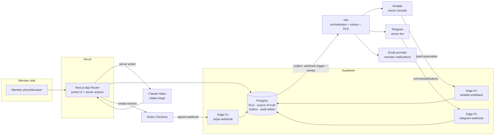

# Cabana — Architecture

**Companion docs:** decisions with full trade-off analysis live in `03-decisions.md` (ADRs). This doc describes the system as designed; the ADRs describe why.

## 1. System overview



**One sentence per component:**

- **Next.js on Vercel** — member portal; server actions do all writes (no client-side service keys, ever); middleware gates authenticated routes.
- **Supabase Postgres** — the single source of truth; RLS enforces member isolation at the database, independent of application code; also hosts the outbox, audit, and idempotency tables.
- **Supabase Edge Functions** — the three inbound webhook surfaces (Stripe, Telegram, Airtable write-back). They validate, translate to state changes, and exit. No business orchestration lives here (ADR-04).
- **Claude Haiku** — intake triage as a bounded subsystem: schema-validated, confidence-gated, logged, and allowed to *draft* but never *commit* (ADR-08).
- **n8n** — all outbound side effects (Airtable, Telegram pings, email), consumed from the outbox with retries, dead-lettering, and an error workflow. Orchestration lives where a non-engineer operator can inspect it (ADR-02).
- **Airtable** — a projection of Supabase for the office persona, not a second source of truth (ADR-01).
- **Telegram** — the owner's front door; webhook mode with secret-token validation and a chat allowlist (ADR-07).

## 2. Data model (core DDL sketch)

Illustrative, not the migration file. Full migrations live in `supabase/migrations/` with one concern per file.

```sql
create extension if not exists btree_gist;

create table businesses (            -- P2 insurance: exists, single row, no tenant UI
  id uuid primary key default gen_random_uuid(),
  name text not null,
  tz text not null default 'America/New_York'
);

create table members (
  id uuid primary key default gen_random_uuid(),
  business_id uuid not null references businesses(id),
  user_id uuid unique references auth.users(id),   -- null until first magic-link sign-in
  full_name text not null,
  email text not null unique,
  phone text
);

create table properties (
  id uuid primary key default gen_random_uuid(),
  member_id uuid not null references members(id),
  address text not null,
  zip text not null,                 -- service-area rule input (D3)
  access_notes text,                 -- gate code, pets: first-class data (D2)
  access_notes_updated_by uuid,
  access_notes_updated_at timestamptz
);

create table plans (
  id uuid primary key default gen_random_uuid(),
  name text not null,                -- three tiers; billing stays in QuickBooks (NG1)
  weekly_day int check (weekly_day between 0 and 6)
);

create table memberships (
  member_id uuid references members(id),
  property_id uuid references properties(id),
  plan_id uuid references plans(id),
  external_billing_ref text,         -- QuickBooks pointer, read-only (P2)
  primary key (member_id, property_id)
);

create table techs (
  id uuid primary key default gen_random_uuid(),
  display_name text not null,
  telegram_chat_id bigint            -- v1.5 tech digests
);

create table bookings (
  id uuid primary key default gen_random_uuid(),
  business_id uuid not null references businesses(id),
  property_id uuid not null references properties(id),
  member_id uuid not null references members(id),
  tech_id uuid references techs(id),
  kind text not null check (kind in ('repair','one_off_clean','plan_visit')),
  status text not null default 'requested' check (status in
    ('requested','needs_review','awaiting_deposit','scheduled',
     'confirmed','completed','cancelled','no_show')),
  request_text text,                 -- member's own words (R1)
  triage jsonb,                      -- validated AI output (R2)
  window tstzrange,                  -- UTC; render in businesses.tz
  deposit_required boolean not null default false,
  external_invoice_ref text,         -- P2
  created_at timestamptz not null default now(),
  -- The double-booking fix lives in the database, not in app code (D6):
  constraint no_tech_overlap exclude using gist
    (tech_id with =, "window" with &&)
    where (status in ('scheduled','confirmed'))
);

create table booking_transitions (   -- audit: every status change, by whom, via what
  id bigint generated always as identity primary key,
  booking_id uuid not null references bookings(id),
  from_status text, to_status text not null,
  actor text not null,               -- 'member' | 'owner:telegram' | 'office:airtable' | 'system:stripe' | 'system:expiry'
  at timestamptz not null default now()
);
-- + trigger enforcing the legal transition graph; illegal transitions raise.

create table payments (
  id uuid primary key default gen_random_uuid(),
  booking_id uuid not null references bookings(id),
  stripe_checkout_session_id text unique,
  amount_cents int not null,
  status text not null check (status in ('pending','paid','expired','refunded')),
  updated_at timestamptz not null default now()
);

create table stripe_events (         -- webhook idempotency ledger (R4)
  id text primary key,               -- Stripe event id
  type text not null,
  payload jsonb not null,
  received_at timestamptz not null default now(),
  processed_at timestamptz
);

create table outbox (                -- transactional outbox (R5, ADR-02)
  id bigint generated always as identity primary key,
  topic text not null,               -- e.g. 'booking.status_changed'
  dedupe_key text not null unique,   -- e.g. booking_id + to_status
  payload jsonb not null,
  created_at timestamptz not null default now(),
  processed_at timestamptz,
  attempts int not null default 0,
  last_error text
);

create table dead_letters (
  id bigint generated always as identity primary key,
  outbox_id bigint references outbox(id),
  workflow text, error text, payload jsonb,
  created_at timestamptz not null default now(),
  resolved_at timestamptz
);

create table ai_events (             -- every model call, auditable (R2)
  id bigint generated always as identity primary key,
  prompt_version text not null,
  input text not null,
  raw_output text,
  parsed jsonb,
  confidence numeric,
  outcome text not null,             -- 'auto_qualified' | 'needs_review' | 'validation_failed' | 'timeout'
  latency_ms int, input_tokens int, output_tokens int,
  created_at timestamptz not null default now()
);

create table telegram_chats (        -- allowlist (R7)
  chat_id bigint primary key,
  label text not null,
  role text not null check (role in ('owner','office'))
);

create table sync_log (              -- Supabase↔Airtable reconciliation evidence (R5/R6)
  id bigint generated always as identity primary key,
  direction text not null,           -- 'to_airtable' | 'writeback'
  entity text, entity_id uuid, airtable_record_id text,
  result text, at timestamptz not null default now()
);
```

**Conventions:** all timestamps `timestamptz` (UTC); rendering in `America/New_York` happens in the UI, email templates, and bot replies only. Writes go through server actions or edge functions — the browser never holds anything above the anon key.

## 3. Row-level security model

RLS is on for every table; default deny. Policies are tested in CI with three JWT fixtures (member A, member B, service role) — the suite asserts member A cannot read member B's rows through any table, including joins.

```sql
alter table bookings enable row level security;

create policy member_reads_own_bookings on bookings for select
  using (member_id in (select id from members where user_id = auth.uid()));

-- Members never write bookings directly; server actions (service role) do,
-- after validation. Members may update exactly one thing themselves:
create policy member_updates_access_notes on properties for update
  using (member_id in (select id from members where user_id = auth.uid()))
  with check (member_id in (select id from members where user_id = auth.uid()));
-- column-level grant restricts the update to access_notes.
```

Key handling rules: anon key in the browser (RLS is the guarantee), service role only in server actions and edge functions via env, never logged, never in `NEXT_PUBLIC_*`. CI runs a secret scanner over history.

## 4. Data flows

### 4a. Repair request → scheduled (the spine of the product)

```
Member submits free text (portal, server action)
 → insert booking(status='requested') + outbox('booking.created')   [one transaction]
 → server action calls Claude Haiku triage (2s budget)
    ├─ valid + confidence ≥ 0.8 + in service area
    │    → status 'awaiting_deposit', triage saved, Stripe Checkout session created,
    │      member sees AI-drafted acknowledgment + payment link
    ├─ valid but low confidence / out of area / plan question
    │    → status 'needs_review', holding reply ("Dana will text you shortly")
    └─ invalid output or timeout
         → status 'needs_review', generic holding reply, ai_events.outcome='validation_failed'
 → every transition writes outbox in the same transaction
 → n8n consumes outbox → Airtable upsert, Telegram ping to Dana
      (Approve / Needs info inline buttons), member email
 → Stripe webhook (checkout.session.completed) → edge fn verifies signature,
    inserts stripe_events (on conflict do nothing → already-processed exits 200),
    payment 'paid', booking → 'scheduled', outbox event
 → Dana taps Approve (or assigns tech/time) → 'confirmed' → member email via n8n
```

Two properties worth noticing: **the member is never blocked by AI failure** (the fallback path is a first-class flow, not an exception handler), and **payment truth flows only left-to-right from Stripe's signed webhook** — the success redirect renders "confirming…" until the database says paid.

### 4b. Outbox delivery (why nothing drops)

State change and outbox row commit atomically. n8n receives a low-latency nudge (Supabase database webhook) *and* runs a 60s sweep for unprocessed rows — the nudge is best-effort, the sweep is the guarantee. n8n dedupes on `dedupe_key`, so nudge+sweep overlap and workflow retries are safe. After 5 attempts with backoff, the row dead-letters and Dana's Telegram gets an alert with the payload summary. A nightly reconciliation job counts Supabase vs. Airtable and posts the result — drift is detected within 24h even if every other safeguard failed. Silence is never ambiguous.

### 4c. Airtable write-back (the fenced exception)

Marie marks a job completed or edits visit notes in the Interface → Airtable automation calls `airtable-writeback` edge fn with a shared secret → edge fn validates field is whitelisted, applies to Supabase, records in `sync_log` and `booking_transitions` (actor `office:airtable`) → normal outbox flow re-projects to Airtable, converging both sides. Any non-whitelisted edit is overwritten by the next sync and logged. Two-way sync as a general capability is explicitly rejected (ADR-01).

## 5. AI subsystem (bounded on purpose)

- **Model:** Claude Haiku. Classification + short drafting at intake volume is a small-model task; cost and latency both matter at the member-facing edge. Escalation to a larger model is a config change, justified only by golden-set failure (ADR-08).
- **Contract:** structured output validated by the same zod schema the app uses for `triage jsonb`. The prompt is versioned in-repo (`prompts/triage/v1.md`); `ai_events.prompt_version` makes every historical decision reproducible.
- **Authority:** the model drafts and classifies; it cannot set price, promise time, or transition past `awaiting_deposit`/`needs_review`. Enforcement is structural (the code paths don't exist), not prompt-based — the prompt asks for good behavior, the architecture makes bad behavior unrepresentable (D8).
- **Evaluation:** 20-case golden set in-repo, run in CI: routine repairs, ambiguous messages, out-of-area, a plan-billing question, a non-English fragment, and two prompt-injection attempts. Threshold behavior is asserted, not hoped.
- **Failure:** timeout budget 2s; on any failure the request proceeds through `needs_review`. The AI layer degrades to "a human will look at this," which is exactly the pre-Cabana baseline — the system's floor is the status quo.

## 6. Failure modes & handling

The table a reviewer should read first. "Detection" is the column amateurs leave blank.

| Failure | Detection | Handling | Worst case after handling |
|---|---|---|---|
| Stripe webhook endpoint down | Stripe dashboard + reconciliation vs. `payments.pending` age alert | Stripe retries ~72h; idempotent processing on recovery | Payment confirmation delayed; never wrong |
| Duplicate / out-of-order Stripe events | `stripe_events` PK conflict | Conflict → ack 200, skip; state machine ignores stale transitions | None |
| n8n down | Sweep gap alarm; unprocessed-outbox age check; error workflow silence itself alarms via external ping | Outbox holds everything; sweep drains on recovery | Notifications delayed, none lost |
| Airtable API failure / rate limit | Workflow error path | Backoff retries → dead-letter + Telegram alert; nightly reconciliation catches residue | Office view stale ≤24h, flagged |
| Telegram API down | Send-step error path | Retry, then dead-letter; email is not substituted silently (owner chose one channel) | Ping delayed; visible in DLQ |
| AI timeout / malformed output | zod + timeout, `ai_events.outcome` | `needs_review` + holding reply | Human triage — the old normal |
| Prompt injection in member text | Golden-set-verified behavior; low confidence routing | Draft-only authority means worst output is a bad *draft* that still can't commit anything | Odd text in a review queue |
| Double-booking race | DB exclusion constraint | Second writer gets structured conflict; UI offers next slots | None |
| DST transition | tz test fixtures (Nov 2026 boundary) | UTC storage + edge rendering | None |
| Deposit paid, member never returns to portal | Webhook is authority; redirect is cosmetic | Status advanced regardless; email confirms | None |
| Secrets leakage | CI secret scan; provider-side rotation runbook in README | Rotate + revoke; anon key exposure is survivable *because* RLS is real | Bounded by RLS |
| Operator edits wrong Airtable field | Next sync + `sync_log` | Overwrite + log (documented behavior, not surprise) | Momentary confusion, audited |

## 7. Observability (right-sized for one operator)

No Grafana stack for a 3-tech pool company. Observability = the structures above plus:
- **Health:** a `/api/health` endpoint (DB reachable, outbox depth, oldest unprocessed age) that n8n checks q5min and alerts on.
- **Money path evidence:** every payment row joins to a stored, verified Stripe event.
- **AI evidence:** `ai_events` is queryable for cost/latency/outcome trends; a `views/ai_daily` rollup feeds `/brief`.
- **Human-facing:** Dana's Telegram is the pager. Alert design rule: every alert states what happened, what the system already did, and whether a human must act.

## 8. Environments & configuration

| Variable | Where | Notes |
|---|---|---|
| `NEXT_PUBLIC_SUPABASE_URL` / `NEXT_PUBLIC_SUPABASE_ANON_KEY` | Vercel | Safe for client by design (RLS) |
| `SUPABASE_SERVICE_ROLE_KEY` | Vercel (server), Edge Fns | Never client, never logged |
| `ANTHROPIC_API_KEY` | Vercel server actions | Triage only |
| `STRIPE_SECRET_KEY` / `STRIPE_WEBHOOK_SECRET` | Edge Fn secrets | Test mode in demo; README documents live-mode differences |
| `TELEGRAM_BOT_TOKEN` / `TELEGRAM_WEBHOOK_SECRET` | Edge Fn secrets | Secret token checked on every update |
| `AIRTABLE_TOKEN` / `AIRTABLE_BASE_ID` / `WRITEBACK_SHARED_SECRET` | n8n / Edge Fn | Scoped token, single base |
| `RESEND_API_KEY` (or equiv.) | n8n | Member email |

Local dev: `supabase start` (local stack), Stripe CLI for webhook forwarding, a tunneled URL for Telegram during development, `seed.ts` builds the full demo world. Prod: Vercel + Supabase cloud + n8n (per OQ2).

## 9. What this architecture is optimizing for

Solo-builder velocity with production instincts: one deployable app, one database that is unambiguously the truth, side effects pushed through one guaranteed-delivery channel, and every external system treated as something that *will* fail. The design spends its complexity budget on exactly three places — payment truth, delivery guarantees, and member data isolation — and is aggressively boring everywhere else. That allocation is the point; see `03-decisions.md` for each fork in the road.
